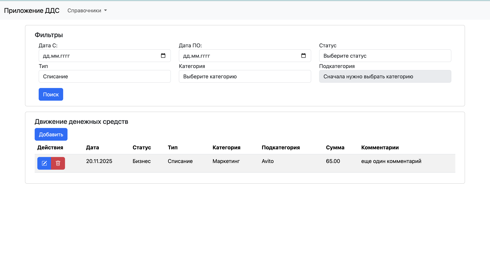
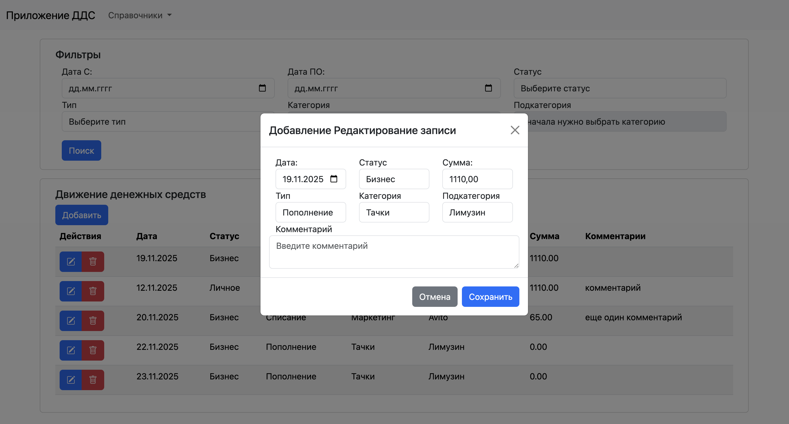

# Движение денежных средств

### Как запустить проект:
Клонировать репозиторий и перейти в него в командной строке:  
```git clone https://github.com/AngelinaLagunova/django_test.git```  
```cd django_test```  
Cоздать и активировать виртуальное окружение:  
```python3 -m venv env```  
* Если у вас Linux/macOS  
```source env/bin/activate```  
* Если у вас windows  
```source env/scripts/activate```

```python3 -m pip install --upgrade pip```  
Перейти в папку dds  
```cd dds```  
Установить зависимости из файла requirements.txt:  
```pip install -r requirements.txt```  
Выполнить миграции:  
```python3 manage.py migrate```  
Запустить проект:  
```python3 manage.py runserver```  

Управление справочниками осуществляется с помощью админ-панели джанго.  
Для остального функционала разработан собственный интерфейс.

Скриншоты:  
  
  


